# Sports On-site Training

## Overview

The sports on-site training platform is a WeChat mini program platform that allows users to book qualified coaches for sports training courses.

## Features

- 管理员可以发布拼班课程，用户可以查看课程，并选择课程进行报名

- 首次进入会弹出隐私保护提示，参考，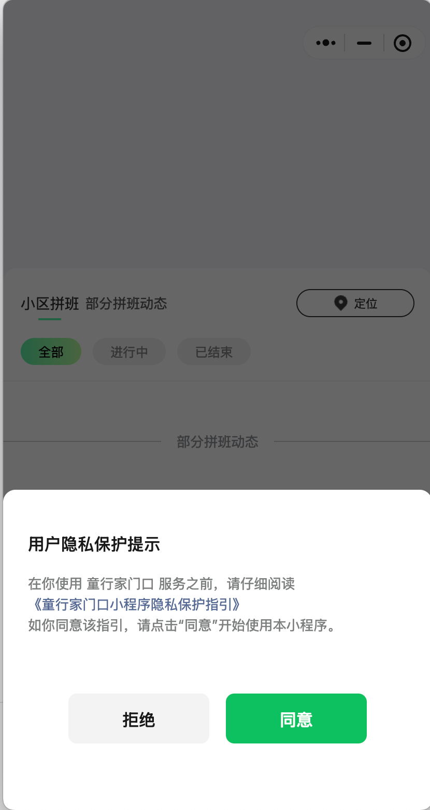

- 同意隐私后进入地理位置授权界面，参考 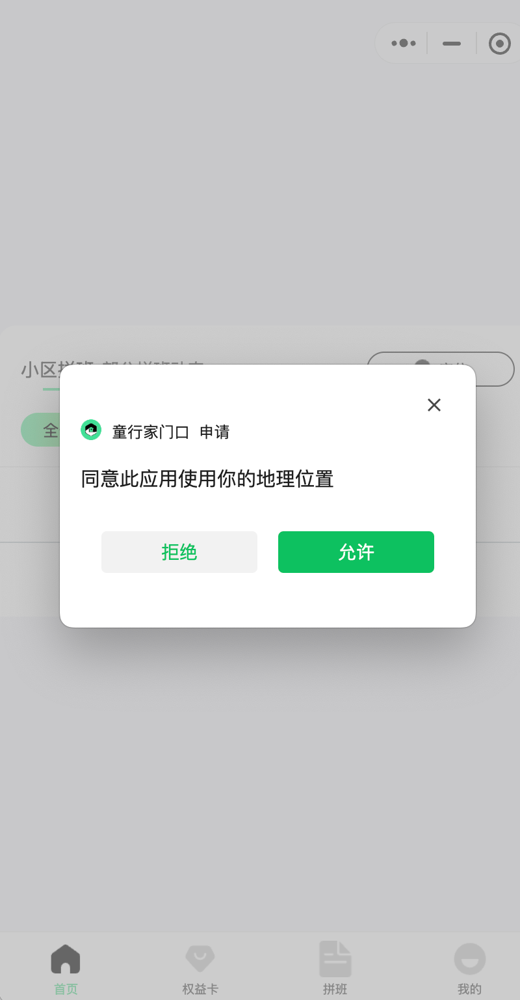

### 首页

- 首页顶部是轮播图，下面是全部、进行中、已结束的班级列表,参考 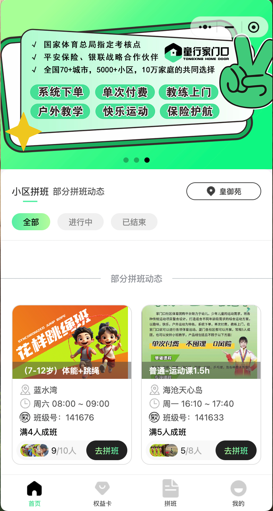

- 首页中支持地图选择小区，点击进入地图界面，参考 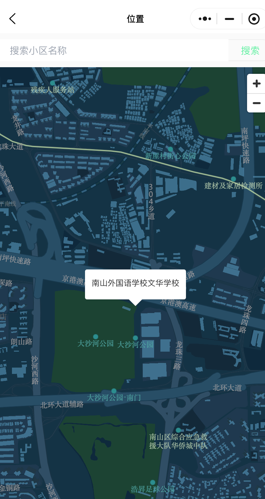

- 点击地图界面的搜索框，跳转到小区列表界面，这些小区支持管理员配置 ，参考 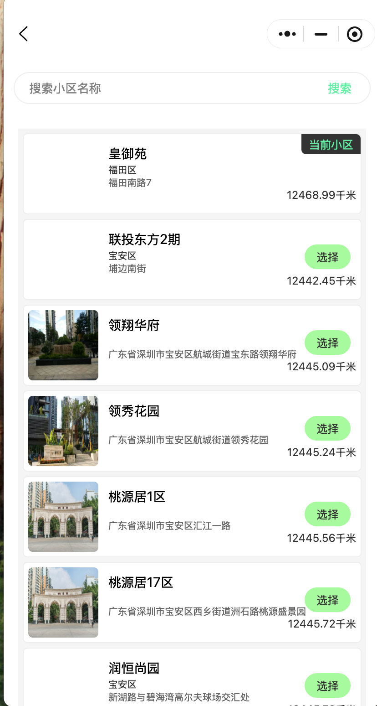

- 点击首页中的班级可以查看班级详情，参考 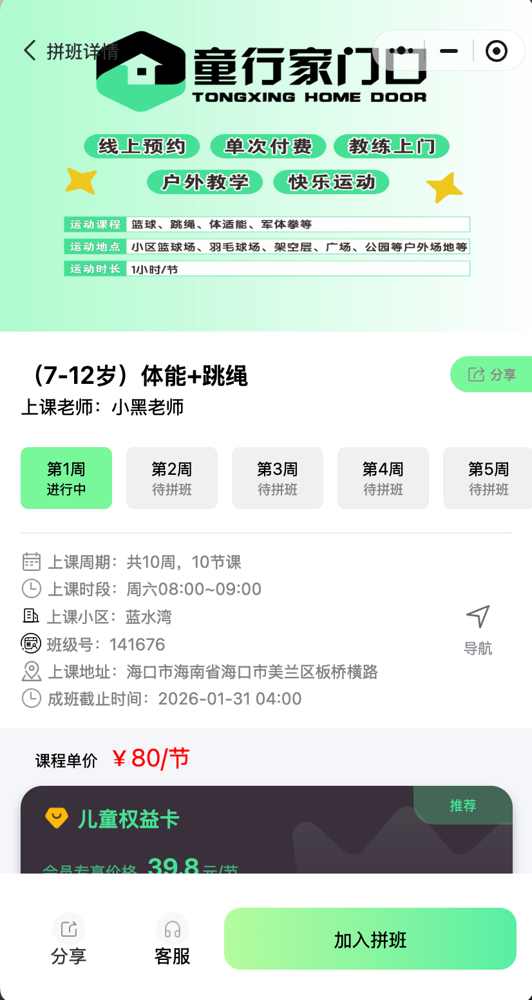 和 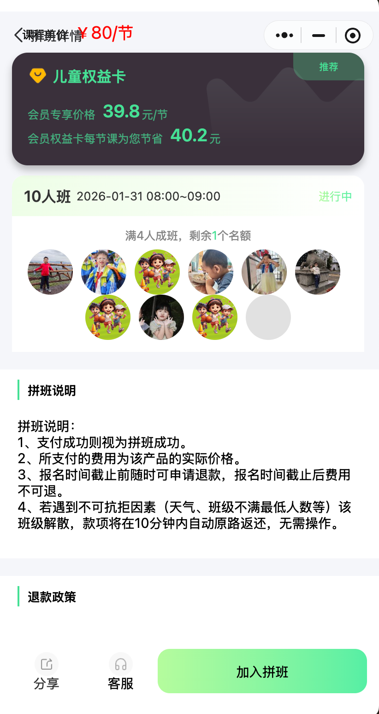

- 点击班级详情中加入拼班按钮，可以进入支付页面，参考  和 参考 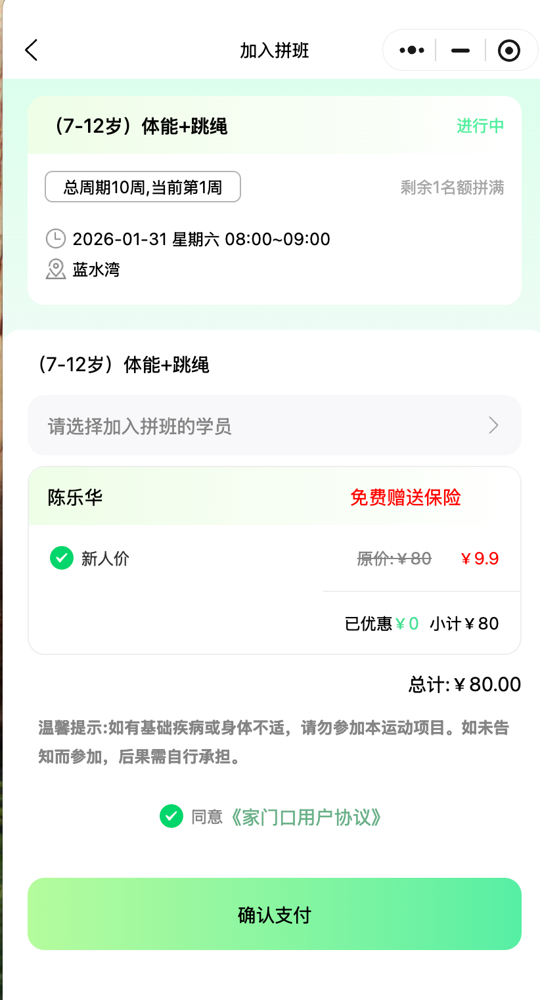

- 点击支付页面中【选择加入拼班的学员】按钮，可以进入选择学员管理页面，参考 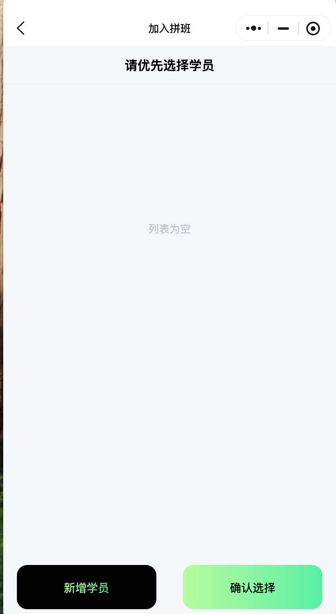 和 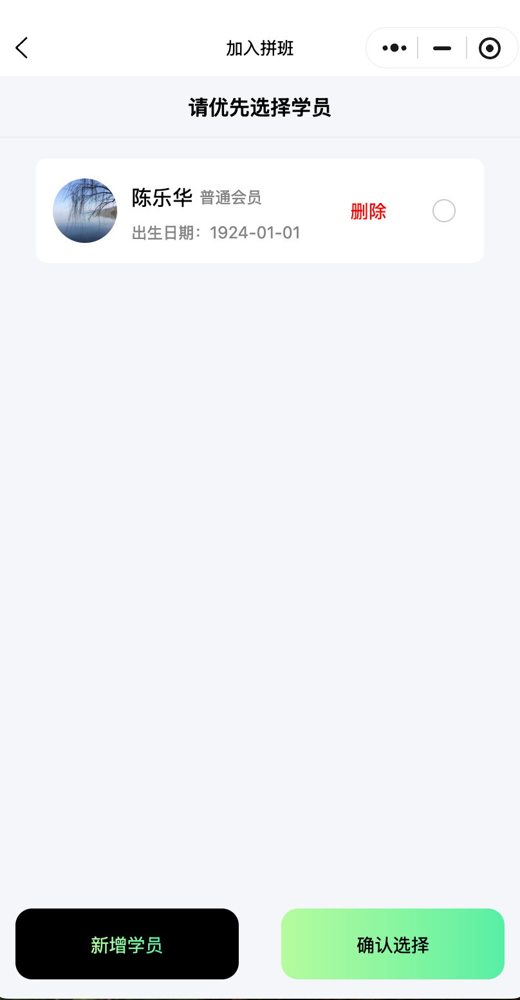

- 学员管理页面新增学员进入新增学员界面，参考 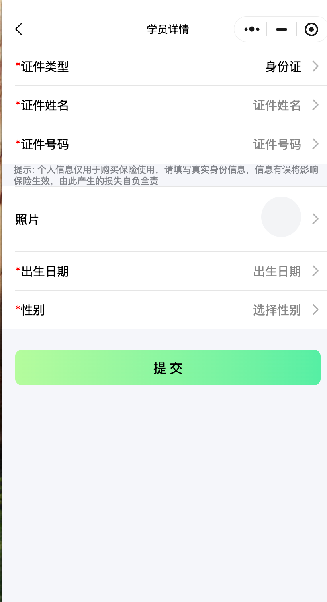

- 点击支付页面中确认支付，进入确认支付页面，参考  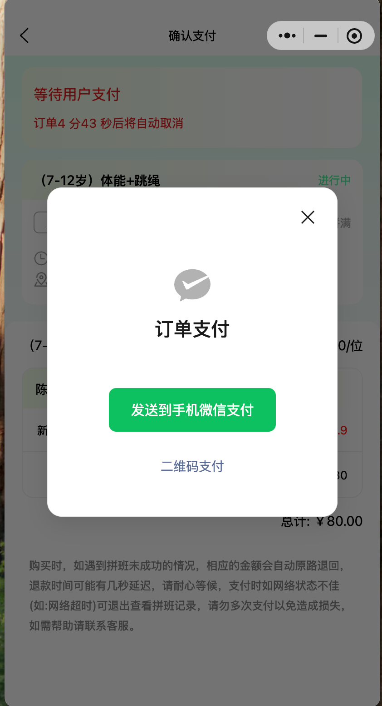 和 

### 拼班页

拼班页， 参考 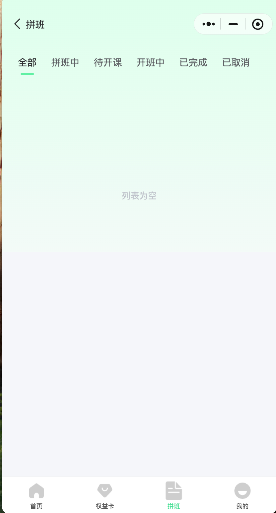

#### 权益卡页

权益卡页，参考 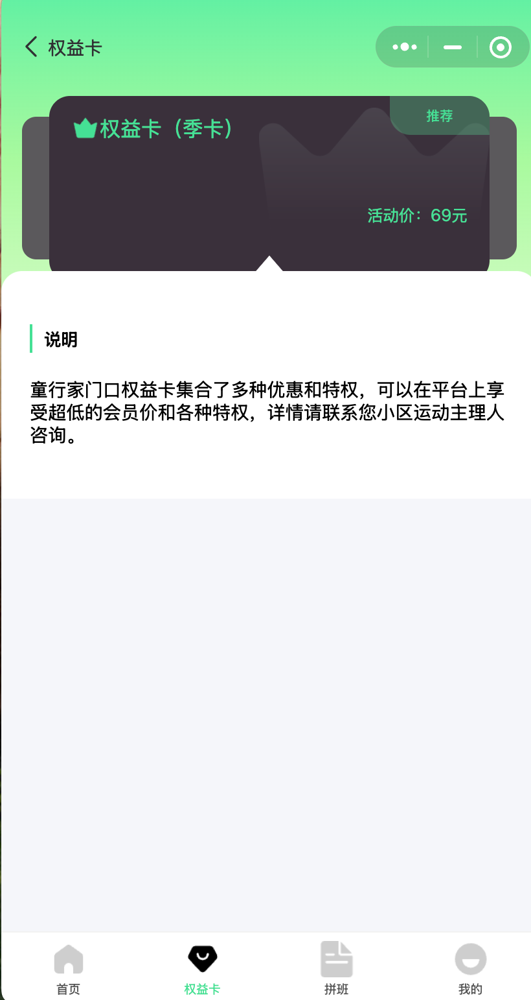

### 我的页

- 我的页，参考 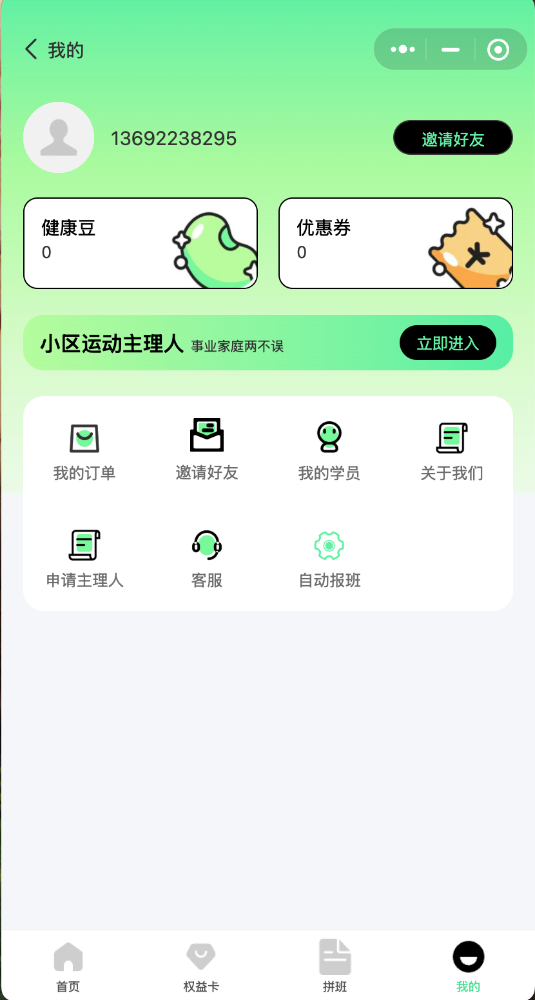 ；
- 我的页，参考 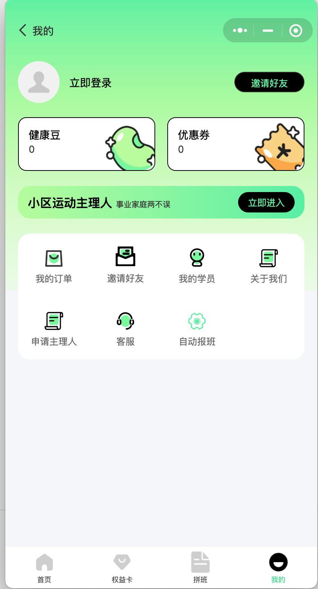 ；
- 点击立即登录，进入登录页，参考 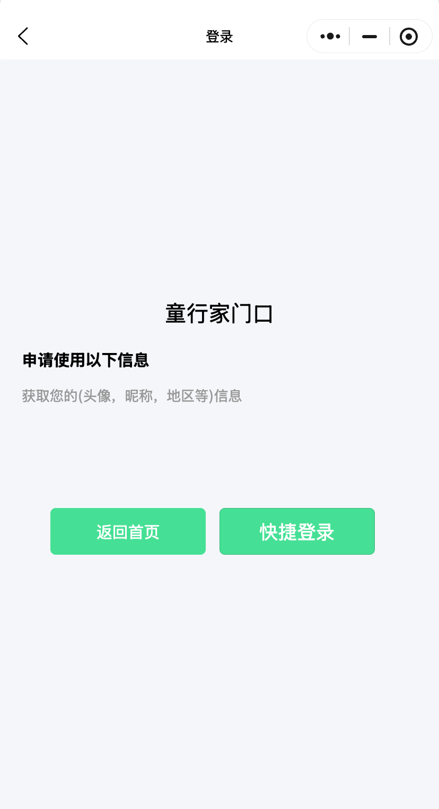 
- 点击登录页中快捷登录，弹出获取微信先关信息，参考 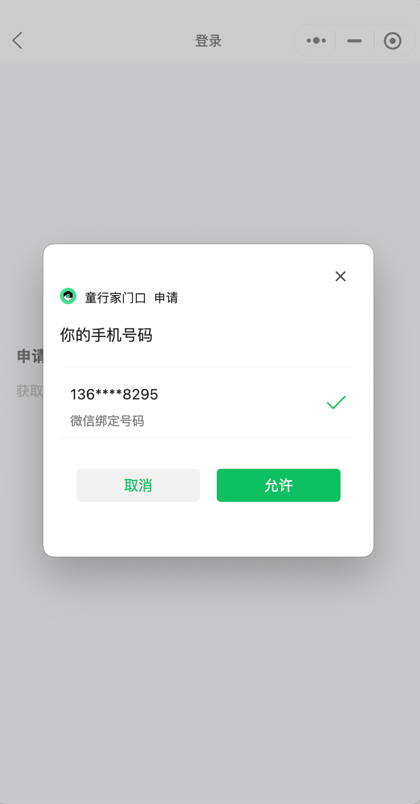 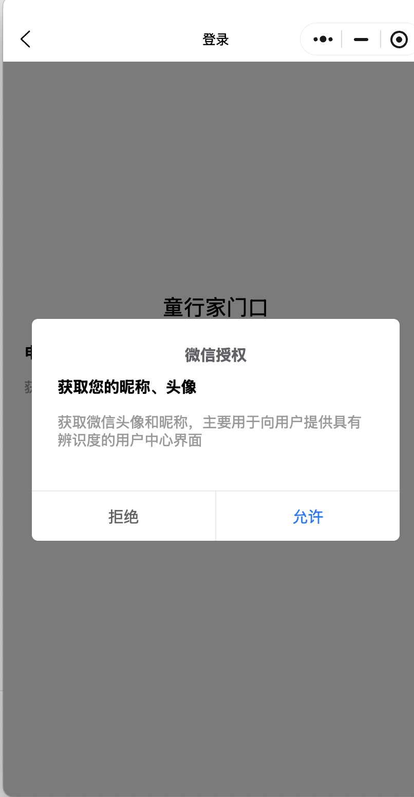 
